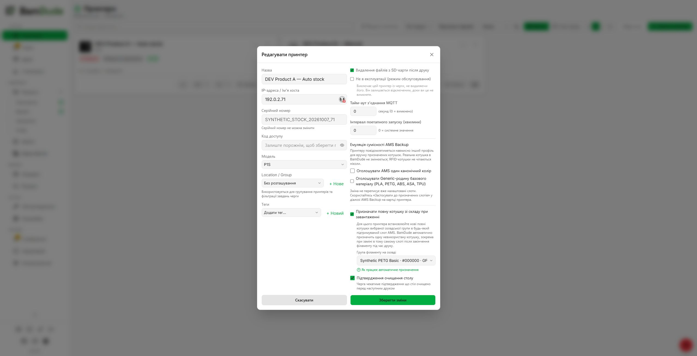

# Automatic full stock spool assignment (issue #66)

## Existing solutions considered

1. BamDude's manual/pre-assignment and RFID auto-assignment (`docs.bamdude.top/features/inventory/`): authoritative inventory links, journal and MQTT publisher already exist and remain the implementation path. Manual assignment alone needs an operator action for every untagged reel. RFID identifies tagged spools and takes priority, but cannot identify arbitrary untagged stock.
2. SpoolmanSync (`github.com/gibz104/SpoolmanSync`): an existing Home Assistant/Spoolman integration. It would add an external inventory owner and does not implement BamDude's runout journal or printer queue policies. It is incompatible with the requested built-in inventory behavior; no new Spoolman integration is added.
3. SQLAlchemy's supported transactions/row locks (`docs.sqlalchemy.org/en/20/orm/queryguide/dml.html`) plus the existing SQLite write-lock helper arbitrate stock claims. No scheduler, persistent event subsystem or alternate usage ledger is introduced.

## Contract and behavior

The firmware may send empty and occupied presence masks before it describes any AMS units. The detector retains the last valid status mask and up to 32 pending transitions within the same connection, using the existing bit decoder when the trays are discovered. A transition can be consumed only once and expires after 30 seconds from the original observation; late metadata cannot renew it. Removal, reconnect or an explicitly invalid/shutdown mask cancels deferred insertion. No identity or emptiness is inferred from filenames, default colors, absent tray metadata or cached UI state. Saving a printer policy with unchanged connection parameters preserves the live MQTT connection and its insertion baseline. Real connection changes still reconnect. Baseline-only occupied reports and every claim/refusal are logged for diagnosis.

`power_on_flag` represents AMS reading at startup, so false is also possible on a live idle A1 Mini. The stock detector may admit an all-zero mask with that flag only when the same local status frame carries a recognized print state and finite, positive nozzle and bed measurements while MQTT is connected. Cached temperatures and command acknowledgements do not qualify. This exception is restricted to stock insertion tracking; the shared AMS cache/virtual-printer shutdown guard remains unchanged.

`Printer.ams_policies.auto_stock_spool` contains `enabled` (default false) and nullable `group`. An enabled policy requires a group with exact `material`, `rgba` (RRGGBBAA), `brand`, `subtype`, `filament_family_id`, `label_weight`. Names are display only. Changes need printer-edit **and** inventory-update authority. Other AMS policy namespaces survive patches. The UI lives in Edit Printer, with descriptive help and the existing Select control; EN/UK translations are included.

`GET /api/v1/inventory/spools/auto-stock-groups` needs inventory-read authority and returns eligible strict groups with `available_count`. Full means actual `weight_used=0` (not the resettable display counter), no previous print usage, positive label weight, unarchived, untagged, solid 1.75 mm filament and no assignment anywhere. An explicit historical `added_full=false` excludes a partial spool; NULL is allowed because ordinary internal single/bulk creation leaves that marker unset. This matches the inventory's remaining-weight calculation without backfilling stored records. Selection is FIFO by `created_at,id`. No inventory spool is fabricated. An exhausted selected group stays selected; no silent fallback to another color/profile/brand.

Insertion requires a fresh local printer status frame with a firmware presence bit going false to true on the same connection. The canonical bit decoder supports regular AMS, AMS HT and normalized A2L AMS Lite. Startup/reconnect only establish a baseline. Missing bits alone, invalid bits, command acknowledgements, unverified shutdown zeros and external holders cannot admit a claim. A metadata-only status may deliver a recent, already witnessed transition for a newly discovered slot. This is an operator declaration that the inserted spool is full and from the selected group; telemetry cannot prove its individual inventory ID or weigh it.

When this policy is enabled, an existing assignment of a known used/partial spool is retained across removal or an untagged metadata reset, including while idle. Returning it without a runout therefore cannot claim a full warehouse spool. A confirmed runout still permits the existing replacement path: by the operator declaration, the next insertion is a new full spool. Pulling a partial spool out mid-print may itself cause runout; returning that old spool then requires manual assignment because untagged telemetry cannot distinguish it from a new full replacement. To intentionally replace a partial spool with a full one without runout, assign the new spool manually: untagged telemetry cannot distinguish that operation from returning the old spool. The existing persistent assignment provides this guard across application restarts; no separate history store is added. RFID identity, external holders, Spoolman and printers with this policy disabled retain their existing unlink behavior.

The insertion callback shares the existing per-printer reconciliation lock, including manual assignment. Claims use a SQLite write lock or PostgreSQL printer/stock row locks with SKIP LOCKED. Immediately before writing, connection generation, age (30 seconds maximum), presence and RFID are rechecked. Manual/pre-assignment wins. A retained assignment can only be replaced if that tray has an open, unambiguous runout of that exact spool; both pause and AMS autoswitch runouts are supported. An assignment made after that runout remains authoritative, including re-linking the same partial reel before insertion. The manual API's assignment timestamp survives deferred fingerprint filling, so reconciliation cannot discard this priority. A later independent runout can still claim stock: priority belongs to the episode, not permanently to the slot. An autoswitch by itself has no insertion edge and consumes no extra spool.

## External holders

External holders expose no reel insertion sensor. They cannot use the AMS empty-to-present path described above; ordinary idle loading still requires manual assignment. With the same opt-in policy enabled, the existing resume callback can declare a new full reel after an external runout. It requires exactly one unresolved, assigned external runout in the active print, a witnessed PAUSE → RUNNING transition in the same locally connected MQTT session, and that specific external feed currently loaded. Both normalized H2D holders are supported; legacy tray 255 meaning unloaded is not evidence for the right holder.

This is the operator's declaration, not automatic identification or weighing of a reel. After such a runout, resume means a new full reel from the selected strict group; returning the old partial reel requires manual assignment before resume. A manual assignment newer than that runout wins, as on AMS. Missing or ambiguous runouts, ordinary pauses, reconnect/startup, RFID, unavailable stock, changed group, unknown profile/feed and duplicate resumes do not claim a reel. The current archive, connection generation and loaded feed are rechecked after waiting for SQL.

The replacement and its runout-layer boundary use the existing journal transaction and assignment lock. Journal failure leaves the outgoing assignment intact. The feature publishes no print/resume command and no in-flight filament configuration. Existing usage splitting and exhausted-tail correction apply only to a real replacement boundary; a same-reel manual correction creates none. Queue matching flags and AMS Backup policies are unchanged. The external follow-up adds no schema, scheduler or second inventory owner.

The existing `note_assignment_change` writer commits the replacement with its journal boundary. If it fails, the auto claim rolls back. Consumption before/after refill, outgoing-spool zero correction and frozen dispatch mapping remain owned by the existing journal/usage tracker. No print resume or queue kick is introduced. Missing stock triggers a warning and manual fallback. Failure to publish configuration leaves the physical spool identity recorded and warns separately; existing assignment read-back verification remains in force.

Configuration uses the same `apply_spool_to_slot_via_mqtt` and projected slot publisher as manual assignment. Queue ignore-color/base-profile flags, explicit overrides, pinned mappings and advertised-versus-actual AMS Backup identity are neither rewritten nor used as permission to choose a different inventory group.

## Validation scope

Only synthetic printers/spools/jobs and disposable SQLite/PostgreSQL targets. New tests cover insertion/reconnect/ack edges, invalid/shutdown masks, slot layouts, stock exclusions, manual/RFID priority, late disappearance, rollback, full-group API/security, overlapping claims, real runout journal/completion splitting and Edit Printer persistence/fallback. Existing routing, queue, overlay, publisher and manual-assignment suites run unchanged. Isolated port-8001 deployment does not provide hardware validation; real printer/RFID timing requires an explicitly approved later trial.

## UI preview

The following screenshots use synthetic stock and a documentation-only printer address. Edit Printer exposes the opt-in checkbox, exact stock group and expandable help through existing shared controls.

### Dark theme

### Light theme

### Expanded help

