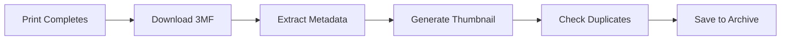

# Print Archiving

BamDude automatically archives every print with full metadata, 3D previews, and duplicate detection.

---

## :material-archive: How Archiving Works

When a print completes:

### What Gets Archived

| Data | Description |
|------|-------------|
| **3MF File** | Complete print file from printer |
| **Thumbnail** | Preview image from slicer |
| **Metadata** | Print settings, layers, filament, etc. |
| **Print result** | Success, failed, or stopped |
| **Duration** | Actual print time |
| **Filament used** | Grams consumed |

!!! warning "SD Card Required"
    An SD card must be inserted in your printer for archiving to work.

---

## :material-cube-scan: 3D Model Preview

View models directly in the browser with Three.js:

- **Rotate** -- Click and drag
- **Zoom** -- Scroll wheel
- **Pan** -- Right-click and drag
- **Plate selector** -- For multi-plate 3MF files

---

## :material-card-text: Archive Cards

Each archive shows thumbnail, filename, printer, duration, result, filament used, tags, and project badge.

### Actions

| Button | Description |
|--------|-------------|
| **Reprint** | Print immediately on a connected printer |
| **Schedule** | Add to print queue |
| :material-cube-outline: | 3D Preview |
| :material-download: | Download 3MF file |
| :material-pencil: | Edit archive details |

---

## :material-view-grid: View Modes

- **Grid View** -- Large thumbnails for visual browsing
- **List View** -- Compact table for data-focused browsing
- **Calendar View** -- Browse archives by date

---

## :material-tag: Tags

Organize archives with custom tags. Filter by tag, combine multiple tags, and manage all tags from the gear icon next to the tag filter.

---

## :material-filter: Filtering & Sorting

Filter by printer, tags, material, color, file type, and favorites. Sort by date, name, or size.

---

## :material-lightbulb: Tips

!!! tip "Batch Operations"
    Enter selection mode to tag, assign projects, or compare multiple archives at once.

!!! tip "Quick Search"
    Press ++slash++ to jump to the search box from anywhere.

> Originally based on [Bambuddy](https://github.com/maziggy/bambuddy) documentation.
