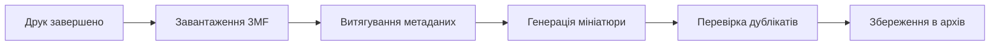

# Архівування друку

BamDude автоматично архівує кожен друк з повними метаданими, 3D-прев'ю та виявленням дублікатів.

---

## :material-archive: Як працює архівування

Коли друк завершується:

### Що архівується

| Дані | Опис |
|------|------|
| **Файл 3MF** | Повний файл друку з принтера |
| **Мініатюра** | Зображення попереднього перегляду зі слайсера |
| **Метадані** | Налаштування друку, шари, філамент тощо |
| **Результат друку** | Успішно, помилка або зупинено |
| **Тривалість** | Фактичний час друку |
| **Витрата філаменту** | Використано грамів |

!!! warning "Потрібна SD-картка"
    Для роботи архівування в принтері має бути встановлена SD-картка.

---

## :material-cube-scan: 3D-перегляд моделі

Переглядайте моделі прямо в браузері за допомогою Three.js:

- **Обертання** -- натисніть і перетягніть
- **Масштабування** -- колесо миші
- **Панорамування** -- права кнопка миші та перетягування
- **Вибір пластини** -- для 3MF-файлів з кількома пластинами

---

## :material-card-text: Картки архіву

Кожен архів показує мініатюру, назву файлу, принтер, тривалість, результат, витрату філаменту, теги та позначку проєкту.

### Дії

| Кнопка | Опис |
|--------|------|
| **Reprint** | Друкувати негайно на підключеному принтері |
| **Schedule** | Додати до черги друку |
| :material-cube-outline: | 3D-перегляд |
| :material-download: | Завантажити файл 3MF |
| :material-pencil: | Редагувати деталі архіву |

---

## :material-view-grid: Режими перегляду

- **Сітка** -- великі мініатюри для візуального перегляду
- **Список** -- компактна таблиця для перегляду даних
- **Календар** -- перегляд архівів за датою

---

## :material-tag: Теги

Організовуйте архіви за допомогою власних тегів. Фільтруйте за тегом, комбінуйте кілька тегів та керуйте всіма тегами через іконку шестерні поруч із фільтром тегів.

---

## :material-filter: Фільтрація та сортування

Фільтруйте за принтером, тегами, матеріалом, кольором, типом файлу та обраним. Сортуйте за датою, назвою або розміром.

---

## :material-lightbulb: Поради

!!! tip "Пакетні операції"
    Увійдіть у режим вибору, щоб позначити тегами, призначити проєкти або порівняти кілька архівів одночасно.

!!! tip "Швидкий пошук"
    Натисніть ++slash++, щоб перейти до поля пошуку з будь-якого місця.

> Базується на документації [Bambuddy](https://github.com/maziggy/bambuddy).
