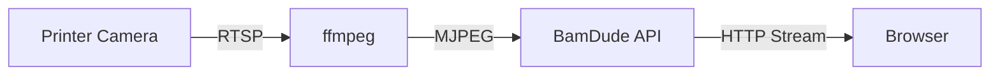

# Camera Streaming

Monitor your prints visually with live camera streaming directly from your Bambu Lab printer.

---

## :material-video: Live Streaming

BamDude provides MJPEG video streaming from your printer's built-in camera, or from an external network camera.

### Opening the Camera

1. Click the :material-camera: camera icon on any printer card
2. Choose between embedded overlay or separate window (configurable in Settings)
3. Stream starts automatically

### Stream Controls

| Button | Action |
|:------:|--------|
| **Live** | Real-time MJPEG video stream |
| **Snapshot** | Single still image (lower bandwidth) |
| :material-refresh: | Restart the stream |
| :material-fullscreen: | Enter fullscreen mode |

---

## :material-webcam: External Cameras

Connect external network cameras to replace the built-in printer camera.

| Type | Example |
|------|---------|
| **MJPEG** | `http://192.168.1.50/mjpeg` |
| **RTSP** | `rtsp://192.168.1.50:554/stream` |
| **Snapshot** | `http://192.168.1.50/snapshot.jpg` |
| **USB (V4L2)** | `/dev/video0` |

Configure in **Settings** > **General** > **Camera**.

---

## :material-magnify: Zoom & Pan

| Method | Action |
|--------|--------|
| **Mouse wheel** | Zoom in/out (100% - 400%) |
| **Click and drag** | Pan when zoomed |
| **Pinch gesture** | Touch device zoom |

---

## :material-cog: Technical Details

| Requirement | Details |
|-------------|---------|
| **ffmpeg** | Must be installed (included in Docker image) |
| **Camera enabled** | Must be enabled in printer settings |
| **Developer Mode** | Required for camera access |

---

## :material-video-box: OBS Overlay

BamDude includes a streaming overlay at `/overlay/{printer_id}` combining camera feed with real-time print status. No login required.

Customize with query parameters: `?size=large&fps=30&show=progress,eta,filename`

---

## :material-lightbulb: Tips

!!! tip "Multiple Cameras"
    In embedded mode, open multiple camera viewers simultaneously -- each remembers its own position and size.

!!! tip "Bandwidth Conservation"
    Close camera windows when not actively watching to save server resources.

> Originally based on [Bambuddy](https://github.com/maziggy/bambuddy) documentation.
