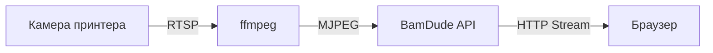

# Трансляція камери

Візуально спостерігайте за друком через живу трансляцію камери безпосередньо з вашого принтера Bambu Lab.

---

## :material-video: Жива трансляція

BamDude забезпечує MJPEG-відеотрансляцію з вбудованої камери принтера або зовнішньої мережевої камери.

### Відкриття камери

1. Натисніть іконку :material-camera: камери на картці принтера
2. Оберіть між вбудованим накладанням або окремим вікном (налаштовується в Параметрах)
3. Трансляція починається автоматично

### Елементи керування

| Кнопка | Дія |
|:------:|-----|
| **Live** | Відеотрансляція MJPEG у реальному часі |
| **Знімок** | Одне статичне зображення (менше навантаження) |
| :material-refresh: | Перезапустити трансляцію |
| :material-fullscreen: | Повноекранний режим |

---

## :material-webcam: Зовнішні камери

Підключайте зовнішні мережеві камери замість вбудованої камери принтера.

| Тип | Приклад |
|-----|---------|
| **MJPEG** | `http://192.168.1.50/mjpeg` |
| **RTSP** | `rtsp://192.168.1.50:554/stream` |
| **Знімок** | `http://192.168.1.50/snapshot.jpg` |
| **USB (V4L2)** | `/dev/video0` |

Налаштовується в **Параметри** > **Загальні** > **Камера**.

---

## :material-magnify: Масштабування та панорамування

| Метод | Дія |
|-------|-----|
| **Коліщатко миші** | Збільшення/зменшення (100% - 400%) |
| **Клік і перетягування** | Панорамування при збільшенні |
| **Жест щипка** | Масштабування на сенсорному пристрої |

---

## :material-cog: Технічні деталі

| Вимога | Деталі |
|--------|--------|
| **ffmpeg** | Має бути встановлений (включений у Docker-образ) |
| **Камера увімкнена** | Має бути увімкнена в налаштуваннях принтера |
| **Режим розробника** | Необхідний для доступу до камери |

---

## :material-video-box: OBS-накладання

BamDude включає накладання для стрімів за адресою `/overlay/{printer_id}`, що поєднує відео з камери зі статусом друку в реальному часі. Авторизація не потрібна.

Налаштування через параметри запиту: `?size=large&fps=30&show=progress,eta,filename`

---

## :material-lightbulb: Поради

!!! tip "Кілька камер"
    У вбудованому режимі відкривайте кілька переглядачів камер одночасно -- кожен запам'ятовує свою позицію та розмір.

!!! tip "Економія трафіку"
    Закривайте вікна камер, коли не спостерігаєте активно, щоб зберегти ресурси сервера.

> Базується на документації [Bambuddy](https://github.com/maziggy/bambuddy).
