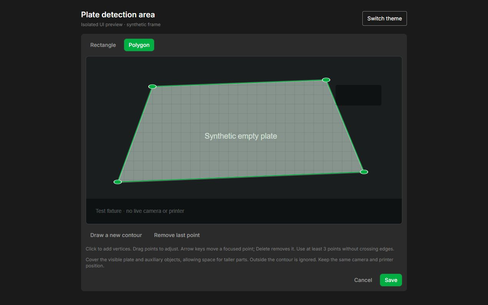
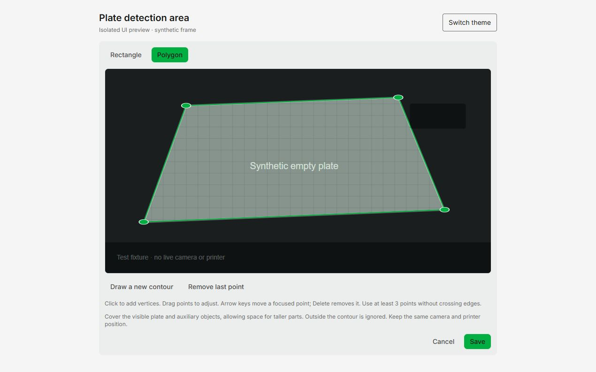
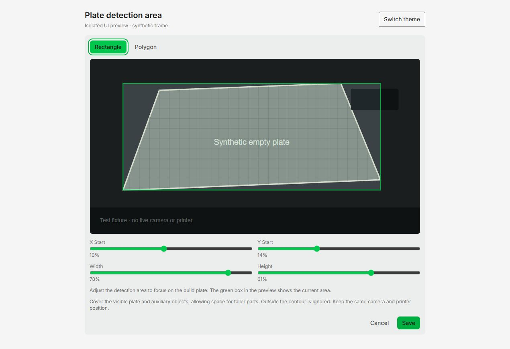

# Plate detection area

Open **Printers → plate detection → detection area → Edit**. Choose Rectangle
(the existing default) or Polygon. The editor uses an original camera frame,
without the diagnostic red overlay. For a polygon, click to add vertices or
drag the existing vertices. A focused vertex can be moved with arrow keys
(Shift increases the step) and removed with Delete. Draw a new contour to start
over. Save validates the contour on the server; Cancel leaves the saved setting
unchanged.

Include the visible plate, auxiliary objects and space for taller parts.
Excluded areas are not checked. Keep the camera and printer in the same pose as
the calibration frames. A polygon does not compensate for changing lighting,
occlusion, moved cameras or objects outside the visible image.

The existing rectangle is retained separately. Choosing Rectangle and saving
sets `plate_detection_polygon` to null. An unrelated printer edit does not
clear the mask. Calibration images remain full original frames and are never
rewritten when the area changes.

`plate_detection_polygon` is an optional list of 3–32 `{x,y}` vertices in
normalized source-image coordinates (0–1). The API rejects non-finite or
out-of-bounds coordinates, repeated vertices, self-intersections and degenerate
areas. The detector creates the mask using OpenCV `fillPoly`. Weighted Gaussian
blur, normalization and the score use only selected pixels, including at the
boundary. A mask too small for the image resolution, unavailable calibration,
invalid frames or a resolution change cannot establish an empty plate in
polygon mode. Rectangle processing remains unchanged.

This change adds no dependencies, printer movements, frame collection,
auto-ejection setting or queue behaviour. SVG was chosen over the already
available Konva canvas and Fabric.js because this editor needs only a scalable
image overlay and accessible vertex controls. Fabric would add an unnecessary
dependency; Konva offers no advantage for this small overlay.

Implementation references: [SVG](https://developer.mozilla.org/en-US/docs/Web/SVG),
[React Konva](https://konvajs.org/docs/react/index.html),
[Fabric.js](https://www.fabricjs.com/docs/).

The screenshots below show the actual editor component with a synthetic frame,
not a live printer camera:

